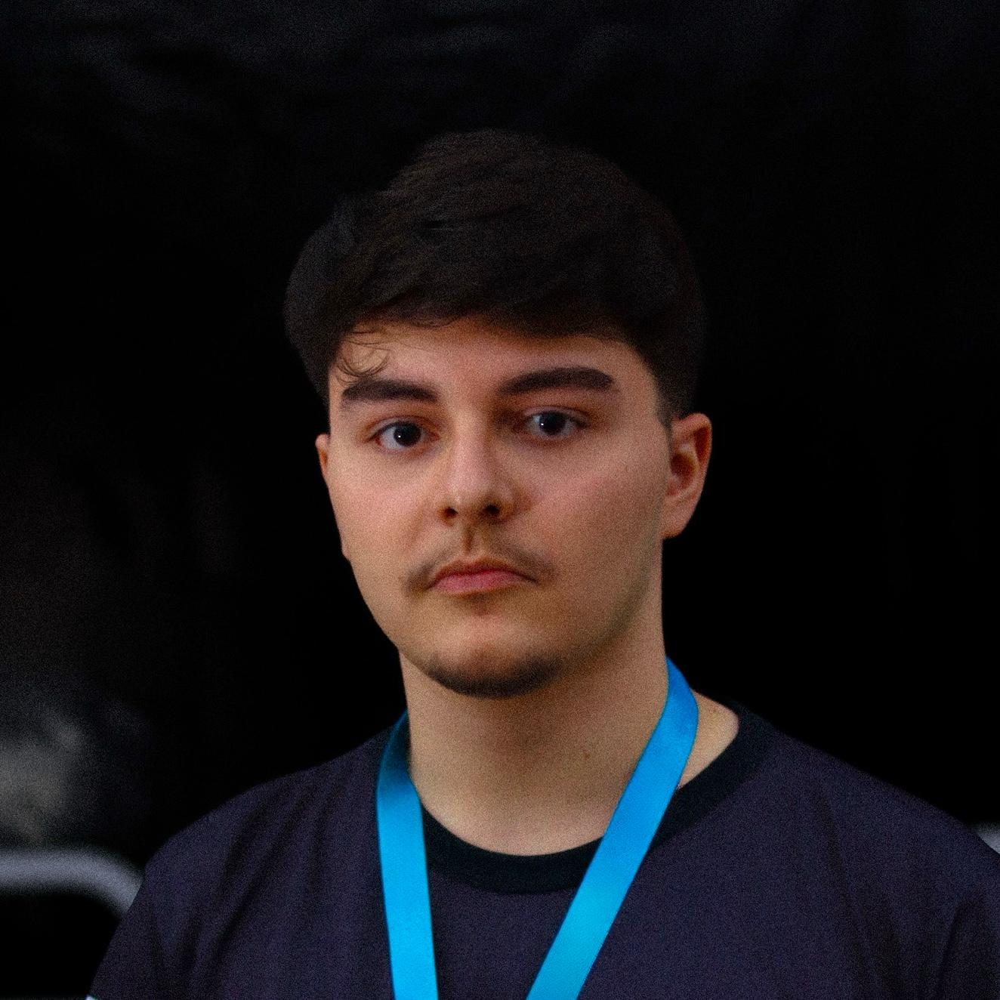

# João Pedro Nogueira Lucas

São José, Divinópolis, Minas Gerais  
(55) 37 98827-1771  
joaonl577@gmail.com  
[LinkedIn](https://www.linkedin.com/in/jo%C3%A3o-pedro-nogueira-235269231/)  

## Sobre

> Estudante de Ciência da Computação na Universidade Federal de Lavras, sou movido pela paixão em unir tecnologia e design. Minhas habilidades se concentram no desenvolvimento web e na criação de interfaces intuitivas e visualmente atraentes.

> Busco constantemente aprimorar meus conhecimentos em T.I., e aplico minhas habilidades em desafios criativos no mercado de trabalho. Meu objetivo é transformar códigos em experiências memoráveis, destacando-me não apenas pela programação, mas pela sensibilidade ao design centrado no usuário. Vamos criar juntos!

## Experiência Profissional

### **SYDLE** — **Software Engineer Trainee** 
*Minas Gerais, Brasil*  |  *02/2024 – Presente*

- Desenvolvimento de software com foco em front-end.
- Atuação no design system da empresa com Stencil.js.
- Uso de Storybook para desenvolvimento e documentação de componentes.
- Versionamento com Git e gerenciamento de pacotes com pnpm.
- HTML, CSS, SASS, JavaScript e TypeScript aplicados em componentes responsivos e acessíveis.

### **Comp Júnior** — **Desenvolvedor de Front-End**
*Minas Gerais, Brasil*  |  *05/2023 – 02/2024*

- Criação de landing pages e sites estáticos.
- Desenvolvimento com HTML, CSS, JavaScript e Vue.js.
- Colaboração em equipes ágeis utilizando Scrum e Kanban.
- Garantia de qualidade e usabilidade em interfaces.

### **Comp Júnior** — **UI/UX Designer** 
*Minas Gerais, Brasil*  |  *05/2023 – 02/2024*

- Redesign do site institucional com foco em UX.
- Prototipagem de interfaces no Figma.
- Mentoria de trainees em design e metodologias ágeis.

### **Comp Júnior** — *Assessor de Marketing*  
*Minas Gerais, Brasil*  |  *05/2023 – 02/2024*

- Criação de conteúdo para redes sociais (Instagram e LinkedIn).
- Produção de fotos, vídeos e newsletters.
- Participação em treinamentos de liderança e estratégia de marketing.

## Educação

**Universidade Federal de Lavras**  
*Bacharelado em Ciência da Computação* — *Desde 2022*

## Habilidades & Ferramentas

* **Línguas:** Português (Nativo), Inglês (Básico)  
* **Tecnologias:** Git, HTML, CSS, SASS, JavaScript, TypeScript, Stencil.js, Vue.js, React.js, MySQL, Java, C++  
* **Design:** Figma, Prototipagem, Design Thinking, UI/UX  
* **Metodologias:** Scrum, Kanban  
* **Soft Skills:** Trabalho em equipe, Liderança, Comunicação, Resolução de problemas, Aprendizagem ativa  
* **Marketing:** Estratégia de conteúdo, Criação para mídias sociais